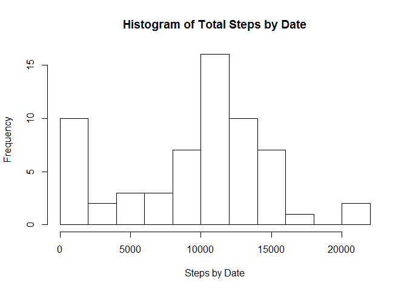
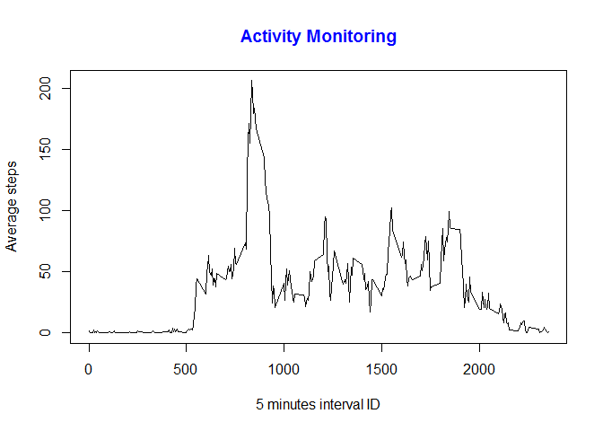
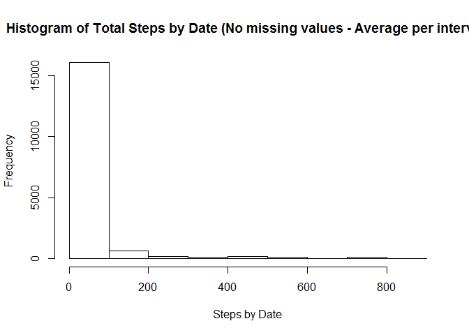
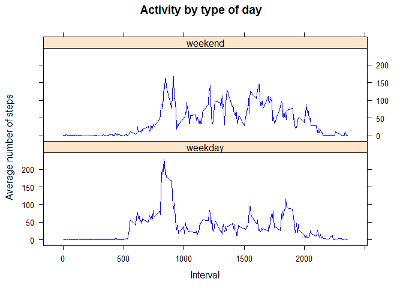

# Reproducible Research: Peer Assessment 1
Ricardo Romo Encino  
May 20, 2017  

## Introduction

This assignment makes use of data from a personal activity monitoring device. This device collects data at 5 minute intervals through out the day. The data consists of two months of data from an anonymous individual collected during the months of October and November, 2012 and include the number of steps taken in 5 minute intervals each day.

The data for this assignment can be downloaded from the course web site:

Dataset: [Activity monitoring data (52 Kb)](https://d396qusza40orc.cloudfront.net/repdata%2Fdata%2Factivity.zip)

The variables included in this dataset are:

- **steps:** Number of steps taking in a 5-minute interval (missing values are coded as NA)
- **date:** The date on which the measurement was taken in YYYY-MM-DD format
- **interval:** Identifier for the 5-minute interval in which measurement was taken

The dataset is stored in a comma-separated-value (CSV) file and there are a total of 17,568 observations in this dataset.

## Loading and preprocessing the data from the downloaded file


```r
activity <- read.csv("activity.csv")
```

## What is mean total number of steps taken per day?

NOTE: The missing values in the dataset are ignored in the calculation
  
1 Calculate the total number of steps taken per day


```r
library(dplyr)
```


```r
activity <- group_by(activity, date)
activityStepsByDate <- summarize(activity, steps = sum(steps, na.rm = TRUE))
```
  
2 Histogram of the total number of steps taken each day


```r
hist(activityStepsByDate$steps, breaks = 10, main = "Histogram of Total Steps by Date",xlab = "Steps by Date")
```

<!-- -->

  
3 Calculate and report the mean and median of the total number of steps taken per day


```r
summary(activityStepsByDate$steps)[4]
```

```
## Mean 
## 9354
```

```r
summary(activityStepsByDate$steps)[3]
```

```
## Median 
##  10400
```

## What is the average daily activity pattern?

1 Make a time series plot (i.e. type = "l") of the 5-minute interval (x-axis) and the average number of steps taken, averaged across all days (y-axis)


```r
activity <- group_by(activity, interval)
activityAvgStepsByInterval <- summarize(activity, avgSteps = mean(steps, na.rm = TRUE))

with(activityAvgStepsByInterval,plot(interval,avgSteps, type = "l", xlab = "5 minutes interval ID", ylab = "Average steps"))
title(main = "Activity Monitoring", col.main = "blue")
```

<!-- -->

2 Which 5-minute interval, on average across all the days in the dataset, contains the maximum number of steps?

Running the following code we can find the 5-minute interval that on average has the maximum number of steps is 08:35


```r
filter(activityAvgStepsByInterval, avgSteps == max(activityAvgStepsByInterval$avgSteps))$interval
```

```
## [1] 835
```

## Imputing missing values

1 Total number of rows with NA


```r
count(filter(ungroup(activity), is.na(steps)))
```

```
## # A tibble: 1 × 1
##       n
##   <int>
## 1  2304
```

2 New dataset equal to the original dataset but with the missing data filled in


```r
activityNoNAs <- merge(activity, activityAvgStepsByInterval, by.x="interval", by.y="interval", all = TRUE) %>% 
                  arrange(date, interval) %>% 
                  mutate(steps = replace(steps, is.na(steps), avgSteps)) %>%
                  select(steps, date, interval)
```

New histogram replacing the missing data with the average steps by interval


```r
hist(activityNoNAs$steps, breaks = 10, main = "Histogram of Total Steps by Date (No missing values - Average per interval)",xlab = "Steps by Date")
```

<!-- -->

3 The mean and median of the total number of steps taken per day are the following:


```r
summary(activityNoNAs$steps)[4]
```

```
##  Mean 
## 37.38
```

```r
summary(activityNoNAs$steps)[3]
```

```
## Median 
##      0
```

After replacing the NAs with the average of steps by interval across all days the histogram, the mean and the median changed. Mainly, because the NAs were replaced by 0.

## Are there differences in activity patterns between weekdays and weekends?

First, a factor variable in the dataset with two levels - "weekday" and "weekend" indicating whether a given date is a weekday or weekend day, was created


```r
wd <- weekdays(as.Date(activityNoNAs$date, format = "%Y-%m-%d"), abbreviate = TRUE)
```

Based on the values in the *wd* variable, adding a column to the data frame containing the type of day value. "weekend" for Saturdays and Sundays, "weekday" for the rest


```r
activityNoNAs <- mutate(activityNoNAs, dayType = factor(ifelse(wd == "sáb." | wd == "dom.", "weekend","weekday"),levels = c("weekday","weekend")))
```

Now is time to group by *type of day* and *interval* in order to summarize the average number of steps


```r
activityNoNAs <- group_by(activityNoNAs, dayType, interval)

activityNoNAsAvgSteps <- summarize(activityNoNAs, avgSteps = mean(steps))
```

To finish the project, plotting the *Activity by type of day* using the **Lattice** package:


```r
library(lattice)
```


```r
par(mfrow = c(2, 1), mar = c(3, 1, 3, 1), oma = c(1, 1, 1, 1), ps = 12)

xyplot(avgSteps ~ interval | dayType,
       data = activityNoNAsAvgSteps,
       type = "l",
       layout = c(1,2),
       main = "Activity by type of day",
       xlab = "Interval",
       ylab = "Average number of steps",
       lty = c(1, 2, 2, 1),
       lwd = c(1, 1, 1, 3),
       col.line = "blue")
```

<!-- -->

End of project.
